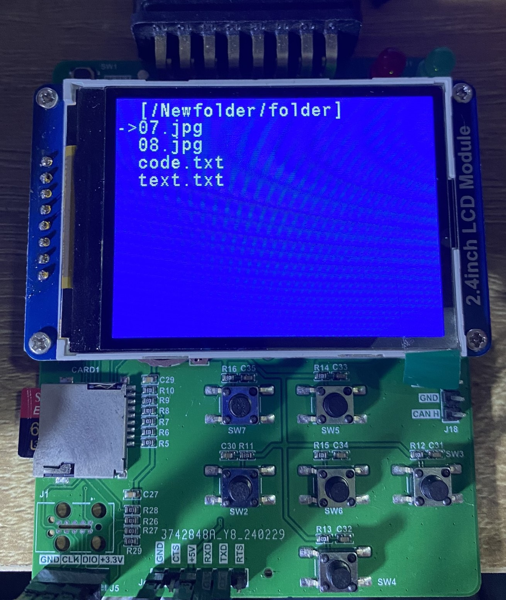

---
# Update:

* Can only work with SDIO 1 bit (don't know why).

* Long file name only work when adding ccsbcs.c in ../Third_Party/FatFs/src/option. Then change _USE_LFN to (1) in ../FATFS/Target/ffconf.h

* The device can handle difference applications, now I only focus on SD card reader application:
## Application selection menu:

---
### Root folder:

---
### The app can handle unlimit sub-folder, can read text and show JPEG image folder/subfolder:

Sub-folder:

subsub-folder:

---
Showing JPEG image:

Reading text, use navigate button to see the rest of the text:

---
# Test with CANBus (loopback) & RTC:

---

---

